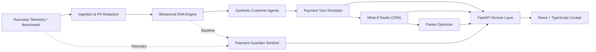

# Payment Twin

> **Razorpay shows what happened. Payment Twin simulates what could happen next.**

**Payment Twin** is a merchant payment-intelligence and behavioral simulation cockpit built for the **Razorpay AI Buildathon 2026**. Modern payment dashboards show historical performance with high fidelity, but merchants have lacked a pre-deployment simulation workspace to reason about what *could* happen before rolling out policy, routing, or fee changes to live customer traffic.

Payment Twin bridges this gap: it extracts empirical merchant dynamics as **Behavioral DNA**, instantiates calibrated synthetic **Customer Agents**, and simulates discrete-event checkout funnels under counterfactual scenarios to optimize net revenue and conversion before deployment.

---

## Live Demo

> **Payment Twin is live.**  
> Explore the deployed simulation engine and run the full merchant intelligence workflow directly in your browser.

**[Launch Payment Twin →](https://payment-twin-64qxtq93i-bhoguni.vercel.app)**

* **Frontend Application**: Deployed on [Vercel](https://payment-twin-64qxtq93i-bhoguni.vercel.app) (`React 18 + TypeScript + Vite`)
* **Production API**: Deployed on [Render](https://payment-twin.onrender.com) (`FastAPI + Python 3.11 + NumPy/SciPy/Pandas`)
* **Interactive API Documentation (Swagger)**: [https://payment-twin.onrender.com/docs](https://payment-twin.onrender.com/docs)

> [!NOTE]
> **Demo Mode & Data Calibration**  
> The live demo runs in calibrated benchmark mode backed by the canonical 650-record retail e-commerce dataset (`data/raw/synthetic_benchmark_retail_ecommerce.jsonl`). Customer Agents represent synthetic cohort behavioral archetypes rather than real individuals or private customer data. The application operates in zero-credential demonstration mode without processing real merchant payments. All simulation outputs, funnel transition metrics, and Pareto frontiers are modeled probabilistic projections based on empirical priors rather than guaranteed real-world financial outcomes.

---

## 1. What It Is

**Payment Twin** is a merchant payment-intelligence and simulation engine. It learns aggregate payment behaviour from empirical transaction data, models the merchant's checkout dynamics as **Behavioral DNA**, instantiates calibrated synthetic **Customer Agents**, and simulates how payment funnels respond to hypothetical interventions before those changes touch live production traffic.

Key capabilities:
- **Behavioral DNA Extraction**: Learns empirical payment method preferences, success rates, retry dynamics, method-switching propensities, and error origin attribution.
- **Synthetic Customer Agents**: Generates calibrated populations of synthetic behavioral agents acting under empirical priors (these are mathematical and algorithmic constructs representing customer cohorts, not individual real persons).
- **Checkout Funnel Simulation**: Simulates the multi-stage payment journey (Session Entry $\to$ Cart $\to$ Rail Selection $\to$ 3DS Authentication $\to$ Gateway Routing) using discrete-event and Monte Carlo simulation.
- **Counterfactual What-If Studio**: Evaluates policy interventions (e.g., method success shifts, retry caps, routing steering, interchange MDR changes) using Common Random Numbers (CRN) for isolated delta attribution.
- **Multi-Objective Pareto Optimization**: Explores competing trade-offs across Net Merchant Revenue, Capture Rate, Processing Fees, and Terminal Failures to recommend optimal operating points.
- **Payment Guardian**: A statistical monitoring companion that continuously tracks operational drift against the learned baseline using dual-gate hypothesis testing (Benjamini-Hochberg FDR + practical effect size thresholds).

---

## 2. The Problem

In modern digital commerce, changing payment policies—such as adjusting retry limits, steering routing across acquirers, or modifying authentication friction—directly impacts top-line revenue and conversion.

Traditional payment dashboards explain **historical performance** with high fidelity, showing what already occurred. However, merchants lack a pre-deployment simulation workspace to reason about what *could* happen before rolling out policy changes to live customers. Experimenting in production risks unnecessary payment declines, cart abandonment spikes, and customer frustration.

Payment Twin provides a risk-free counterfactual sandbox to test, compare, and optimize payment decisions before deployment.

---

## 3. What Payment Twin Does (Implemented Flow)

The system is implemented as an end-to-end analytical and simulation pipeline:

```
Observed Payment Data (Razorpay API / Benchmark Dataset)
       │
       ▼
1. PII Sanitization & Data Normalization
       │
       ▼
2. Behavioral DNA Engine (Empirical Priors, Wilson CIs, Transition Matrices)
       │
       ▼
3. Synthetic Customer Agents (Calibrated Behavioral Archetypes & Decision Rules)
       │
       ▼
4. Payment Twin Simulation (Discrete-Event Funnel & Stochastic Event Accounting)
       │
       ▼
5. What-If Studio (Paired Counterfactual Scenarios with Mechanism and Attribution Trails)
       │
       ▼
6. Pareto Optimizer (Multi-Objective Non-Dominated Policy Frontier)
       │
       ▼
7. Payment Guardian (Statistical Drift Monitoring & Baseline Diagnostics)
```

---

## 4. Product Workspaces

Payment Twin provides 8 dedicated operational workspaces:

| # | Workspace | Purpose & Description |
| :-: | :--- | :--- |
| **1** | **Overview** | Merchant command center displaying captured payment volume, baseline capture rates, payment rail mix (UPI, Card, Netbanking, Wallet), Guardian attention signals, and rapid intelligence pathways. |
| **2** | **Behavioral DNA** | Empirical baseline profile derived from transaction records. Displays method selection priors with 95% Wilson confidence intervals, amount distribution quantiles (P10–P99), retry and method-switch dynamics, and error origin attribution. |
| **3** | **Customer Agents** | Inspector for the synthetic agent population calibrated to the merchant's DNA. Features archetype filtering (Fast Checkout, Patient Retryer, Method Switcher, High Ticket), behavioral fingerprints ($P_{\text{retry}}$, friction tolerance), and step-by-step decision pathways. |
| **4** | **Payment Guardian** | Continuous statistical drift sentinel. Uses dual-gate testing (Benjamini-Hochberg FDR correction at $\alpha=0.05$ combined with effect size thresholds) across 10 drift detectors (PSI, Z-Test, Fisher Exact, Two-Sample KS, CUSUM) to detect meaningful divergence from baseline. |
| **5** | **Payment Twin** | Flagship simulation workspace. Features a dark simulation instrument executing a 5-stage checkout funnel (Session $\to$ Cart $\to$ Rail $\to$ Auth $\to$ Gateway) with configurable population size, deterministic PRNG seed, terminal outcome accounting, and individual agent trace drawers. |
| **6** | **What-If Studio** | Counterfactual decision workspace. Allows merchants to manipulate policy levers (UPI success shift, card success shift, rail preference, retry budgets, interchange MDR) using paired Common Random Numbers (CRN) to isolate exact revenue and conversion deltas. |
| **7** | **Pareto Optimizer** | Multi-objective optimization workspace. Evaluates a Cartesian search grid of policy interventions against competing objectives (Net Revenue vs. Capture Rate vs. Processing Fees vs. Failure Rate) with hard feasibility guardrails and recommended operating points. |
| **8** | **Settings** | Configuration and operational diagnostics. Manages Razorpay API test credentials, synthetic benchmark data synchronization, stochastic engine defaults, dataset repository logs, and backend service health. |

---

## 5. How the Simulation Works

Payment Twin relies strictly on **verifiable statistical, probabilistic, and discrete-event simulation methods** (it does not rely on opaque LLM hallucinations for numerical simulation):

1. **Empirical Calibration**: Behavioral DNA fits probability distributions (Dirichlet-Multinomial priors, log-normal ticket sizes, empirical transition matrices) directly from sanitized transaction records.
2. **Synthetic Population Generation**: Synthetic agents are instantiated with parameter vectors ($\text{AOV}$, method preference vector, retry patience threshold, friction sensitivity) sampled from the fitted distributions.
3. **Discrete-Event Simulation**: As agents traverse the funnel stages, outcomes are evaluated using Bernoulli and Categorical sampling. Failed attempts trigger conditional retry and method-switch loops governed by each agent's behavioral budget.
4. **Common Random Numbers (CRN)**: Counterfactual scenarios in What-If Studio reuse identical pseudo-random number seeds across paired baseline and scenario runs. This isolates modeled policy intervention shifts from random seed variance (variance reduction via matched random draws).
5. **Multi-Objective Optimization**: The Pareto Optimizer employs Pareto dominance criteria to filter out dominated configurations and surface the non-dominated trade-off frontier.
6. **Drift Detection**: Payment Guardian applies classical statistical hypothesis tests (Two-Proportion Z-Tests, Two-Sample Kolmogorov-Smirnov, Population Stability Index, CUSUM) with False Discovery Rate controls to identify real statistical drift without crying wolf.

---

## 6. Architecture

For the complete technical specification, system taxonomies, checkout state machine diagrams, and mathematical formulas, see:

👉 [**docs/architecture.md**](docs/architecture.md)

### Pipeline Overview



---

## 7. Tech Stack

### Frontend
- **Framework**: React 18 with TypeScript
- **Build Tool**: Vite 5.4
- **Styling**: Tailwind CSS (bespoke fintech theme inspired by Ledgerix / Mercury / Stripe)
- **State Management & Data Fetching**: TanStack React Query v5 & Zustand
- **Visualization & Icons**: D3.js, Lucide React, Framer Motion

### Backend
- **Framework**: Python 3.11+ / FastAPI (fully asynchronous REST service)
- **Data Modeling & Validation**: Pydantic v2
- **Numerical & Statistical Computing**: NumPy, SciPy, Pandas, scikit-learn
- **HTTP Client**: HTTPX

### Automated Testing
- **Test Runner**: Pytest (12 automated test suites covering ingestion, profiling, agents, simulation, optimization, and drift detection)
- **Frontend Validation**: TypeScript compiler (`tsc --noEmit`) and Vite production build validation

---

## 8. Quick Start

### Prerequisites
- **Python 3.11+**
- **Node.js 18+** and `npm`

---

### Step 1: Start the Backend Service

```bash
cd backend

# Create and activate a Python virtual environment
python3 -m venv .venv
source .venv/bin/activate

# Install backend dependencies
pip install --upgrade pip
pip install -r requirements.txt

# Start the FastAPI server (runs on port 8000)
uvicorn app.main:app --port 8000 --reload
```

The backend will start at `http://localhost:8000`.
Interactive Swagger API documentation is available at `http://localhost:8000/docs`.

---

### Step 2: Start the Frontend Application

Open a second terminal window:

```bash
cd frontend

# Install dependencies
npm install

# Start the development server
npm run dev
```

The frontend will start at `http://localhost:5173`. Open this URL in your browser.

---

## 9. Reviewer & Judge Walkthrough (3-Minute Tour)

When evaluating the live application, follow this sequence:

1. **Overview (`#overview`)**: Review aggregate merchant volume (₹12,13,854, 83.5% capture rate), rail distribution needles, and system sentinel status.
2. **Behavioral DNA (`#dna`)**: Inspect the empirical foundation—rail mix priors with Wilson confidence intervals, quantile distribution slider, and error origin attribution.
3. **Customer Agents (`#agents`)**: Explore the 1,000 synthetic agent population. Filter by archetype (e.g. *Method Switcher*) and click any agent row to inspect their behavioral fingerprint and decision pathway.
4. **Payment Guardian (`#guardian`)**: Review the active surveillance status (10 drift tests, BH-FDR $\alpha=0.05$) and expand the mathematical detectors to examine test thresholds.
5. **Payment Twin (`#twin`)**: In the simulation controls, click **Run Simulation**. Watch the 5-stage funnel compute stage-by-stage on the dark simulation canvas, view drop-off attribution, and open an agent event trace.
6. **What-If Studio (`#scenarios`)**: Adjust a scenario slider (e.g., set UPI Success Shift to `+5.0%` or Max Retries to `2x`) and click **Run Counterfactual**. Observe the exact net revenue delta (+₹38,514) and mechanism and attribution trail.
7. **Pareto Optimizer (`#pareto`)**: Click **Run Optimization (27)**. Examine the non-dominated frontier scatter plot, select Candidate #9, and inspect the multi-objective trade-off rationale.
8. **Settings (`#settings`)**: Verify Razorpay API test connectivity and view local dataset repository provenance.
9. **Global Search**: Press `⌘K` (or `Ctrl+K`) anywhere in the app to open the quick navigation palette.

---

## 10. Data Provenance & Known Limitations

- **Synthetic Benchmark Foundation**: For zero-credential evaluation, the repository includes a canonical 650-record retail e-commerce dataset (`data/raw/synthetic_benchmark_retail_ecommerce.jsonl`). If no live Razorpay API keys are configured, Payment Twin automatically boots into this calibrated benchmark mode with clear visual badges.
- **Privacy & PII**: The system strictly redacts customer PII (no customer emails, names, phone numbers, or plain PANs are ever stored or processed).
- **Simulation Disclaimer**: Forward simulation outputs are probabilistic projections based on empirical priors and stochastic agent rules; they do not constitute guaranteed financial outcomes.
