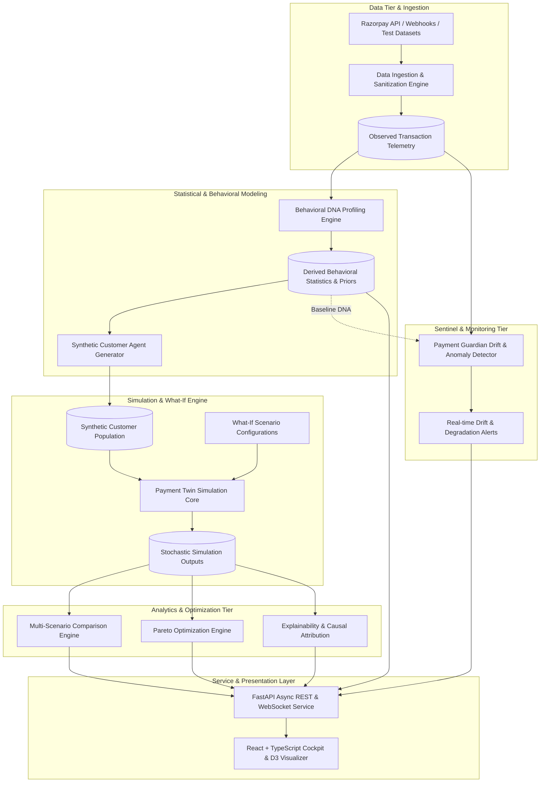
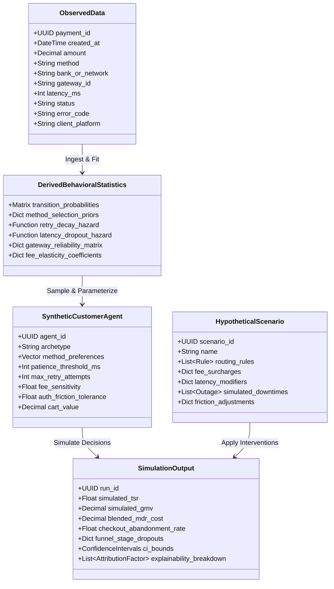
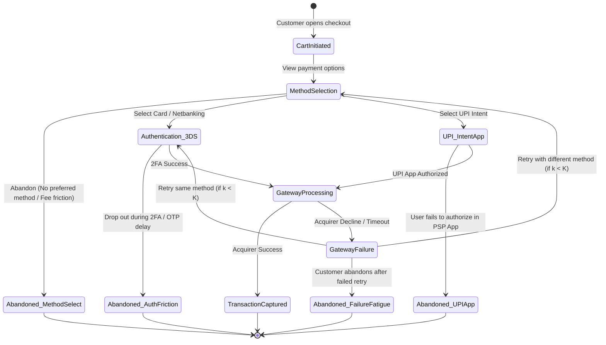
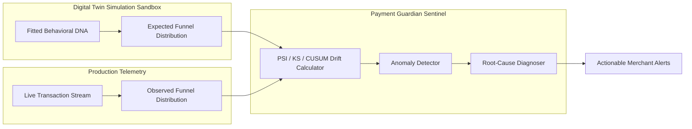

# Payment Twin: Architecture & Technical Specification

> **Document Status**: Complete Architectural Specification  
> **Version**: 1.0.0  
> **Target System**: Production-Grade Fintech Behavioral Simulation & Risk Sentinel

---

## 1. System Architecture Overview

Payment Twin is architected as an end-to-end analytical, probabilistic modeling, simulation, and real-time monitoring engine. It models the entire lifecycle of merchant payment processing—from customer intent and checkout interaction to payment gateway routing, network authorization, failure handling, and real-time anomaly detection.

### 1.1 End-to-End Architectural Pipeline

---

## 2. Taxonomy of Core Data Dimensions

To maintain absolute mathematical and architectural clarity, Payment Twin enforces a strict separation across five core data dimensions:

### 2.1 Observed Data (Empirical Ground Truth)
Observed data encompasses raw, verifiable transaction and event logs recorded from Razorpay APIs (`GET /v1/payments`), webhooks, or test datasets.
- **Transaction Identifiers**: Payment ID (`pay_...`), Order ID (`order_...`), Invoice ID.
- **Financial Values**: Gross Amount (paise/INR), Currency (`INR`), Gateway Fee, Tax on Fee, Refunded Amount.
- **Payment Method Telemetry**: Method category (`card`, `upi`, `netbanking`, `wallet`, `emi`), Bank Identifier (e.g. `HDFC`, `SBIN`), Wallet code (`paytm`, `mobikwik`), VPA provider handle (`okaxis`, `okhdfcbank`).
- **Terminal States**: `captured`, `authorized`, `failed`, `refunded`.
- **Diagnostic Error Fields (on failures)**: `error_code`, `error_description`, `error_source` (`customer`, `gateway`, `bank`), `error_step` (`payment_authentication`, `payment_authorization`), `error_reason` (`incorrect_otp`, `insufficient_funds`, `payment_cancelled`).
- **Acquirer Telemetry**: Acquirer RRN, Auth Code, UPI Transaction ID.
- **Timestamps**: `created_at` UNIX epoch and ISO 8601 UTC.

> [!NOTE]
> **Data Boundary**: Raw Razorpay payment data does **not** include unobserved pre-checkout cart abandonments or psychological customer traits (e.g., price elasticity, patience thresholds). Those are modeled independently in the Behavioral DNA and Synthetic Agent tiers.

### 2.2 Derived Behavioural Statistics (Behavioral DNA)
Behavioral DNA represents the mathematical and statistical profile of the merchant's customer base, derived by fitting parametric and non-parametric distributions over observed data:
- **Funnel Transition Matrices**: Markov state transition probabilities $P(S_{t+1} \mid S_t)$ governing progression from Cart View $\to$ Method Selection $\to$ 2FA/3DS $\to$ Capture / Failure / Retry / Abandonment.
- **Method Selection Priors**: Conditional probability distributions $P(\text{Method} \mid \text{AOV}, \text{Platform}, \text{HourOfDay})$.
- **Retry Fatigue Hazard Functions**: Empirical probability distribution $P(\text{Retry} \mid \text{Attempt } k, \text{Error Code } e)$ modeling customer willingness to retry after transient gateway or card decline failures.
- **Latency Sensitivity Hazard Curves**: Survival/dropout probability $S(t) = P(\text{Abandon} \mid \text{Latency } t)$ modeling abandonment as checkout or 2FA verification times increase.
- **Gateway Reliability Profiling**: Acquirer-specific and method-specific baseline success rates $P(\text{Success} \mid \text{Gateway } g, \text{Bank } b)$.

### 2.3 Synthetic Customer Agents
Synthetic Customer Agents are stateful, probabilistic computational entities instantiated by sampling from the merchant’s Behavioral DNA. Each agent acts autonomously within the simulated checkout environment:
- **Agent State Vector**:
  $$\mathbf{A}_i = \langle \text{AOV}_i, \mathbf{P}_i^{\text{methods}}, \tau_i^{\text{patience}}, K_i^{\text{max\_retries}}, \epsilon_i^{\text{fee}}, \gamma_i^{\text{3DS}} \rangle$$
- **Archetype Profiles**:
  - *Tech-Savvy UPI-First*: High preference for UPI Intent, low patience for redirects, zero retry friction tolerance for OTP delays.
  - *High-AOV Cardholder*: High cart value, high tolerance for 3DS challenges, sensitive to card surcharges, multiple fallback cards.
  - *Price-Sensitive Value Shopper*: Highly sensitive to convenience fees/surcharges ($\epsilon^{\text{fee}} \gg 1$), will switch methods or abandon if surcharges exceed threshold.
  - *Impatient Mobile Shopper*: Steep latency dropout hazard curve; abandons if checkout processing exceeds 3,000ms.

### 2.4 Hypothetical Scenario Inputs
Scenarios represent user-defined business, pricing, or infrastructural interventions to be evaluated in the simulation sandbox:
- **Gateway Routing Interventions**: Route specific BINs, banks, or methods to Gateway A (low fee, medium reliability) vs. Gateway B (high fee, premium SLA).
- **Fee & Surcharge Interventions**: Introduce fixed or percentage-based convenience fees on credit cards or COD.
- **Authentication & Friction Interventions**: Simulate 3DS 2.0 biometric frictionless authentication vs. mandated OTP SMS fallback.
- **Infrastructure Stress Scenarios**: Simulate a major bank (e.g., HDFC/SBI Netbanking) experiencing a 60% degradation or total outage during a high-traffic sale event.
- **Promotional Incentives**: Instant cashback / discount incentives applied conditionally to UPI Intent or RuPay credit on UPI.

### 2.5 Simulation Outputs
Simulation outputs are the aggregated, quantifiable metrics and distributions generated across Monte Carlo runs:
- **Primary KPIs**:
  - **Simulated TSR (Transaction Success Rate)**: $\frac{\text{Total Captured Transactions}}{\text{Total Checkout Initiations}}$
  - **Net GMV**: Total successfully processed payment volume minus processing fees.
  - **Blended Merchant Discount Rate (MDR)**: Effective processing cost percentage across all successful orders.
  - **Funnel Stage Drop-off Breakdown**: Stage-by-stage attrition (Cart $\to$ Method Selection $\to$ 2FA $\to$ Gateway Failure $\to$ Abandonment).
- **Distributional Reliability**: 95% Bootstrap Confidence Intervals for all KPIs.
- **Trade-off Frontiers**: Multi-objective Pareto frontier sets balancing TSR vs. MDR Costs.
- **Explainability & Impact Attribution**: Quantified feature attribution explaining the delta ($\Delta\text{TSR}, \Delta\text{GMV}$) between baseline and scenario.

---

## 3. Checkout Funnel State Machine

The simulation core operates a discrete-state transition machine representing customer journeys:

---

## 4. Component-by-Component Architectural Blueprint

### 4.1 Ingestion & Sanitization Engine
- **Responsibilities**:
  - Validates and parses incoming Razorpay API responses, webhook payloads, and CSV exports.
  - Enforces strict PII redaction (masking cardholder names, email addresses, phone numbers, full card numbers; keeping only tokenized identifiers, BIN ranges, bank codes, and method categories).
  - Normalizes heterogeneous timestamps, error codes, and currency denominations into canonical internal schema definitions.

### 4.2 Behavioral DNA Profiling Engine
- **Responsibilities**:
  - Computes empirical transition probability matrices across all funnel steps.
  - Fits non-parametric Kernel Density Estimations (KDE) and parametric distributions (Log-Normal, Weibull) over payment latency and abandonment time.
  - Calculates method selection priors conditioned on cart amount brackets ($\le ₹500, ₹500\text{-}₹2000, > ₹2000$), platform, and time.
  - Derives gateway reliability vectors: $P(\text{Success} \mid \text{Gateway}, \text{Method}, \text{IssuerBank})$.

### 4.3 Synthetic Customer Agent Generator
- **Responsibilities**:
  - Implements multivariate sampling algorithms (e.g., Gaussian Copula / stratified sampling) to instantiate customer agents preserving empirical correlations (e.g., higher AOV correlated with credit card usage and higher patience).
  - Populates agent decision parameters including willingness-to-pay surcharges and retry thresholds.

### 4.4 Payment Twin Simulation Core
- **Responsibilities**:
  - Manages discrete-event queues and stochastic state updates.
  - Runs parallelized Monte Carlo iterations with deterministic random seed management for reproducibility.
  - Evaluates agent decision policies at each funnel node against scenario-specific gateway latency, fee, and routing parameters.

### 4.5 What-If Scenario Engine
- **Responsibilities**:
  - Accepts declarative scenario configuration payloads.
  - Compiles routing rule trees (e.g., condition predicates based on amount, method, BIN) and applies parameter overrides onto the base Behavioral DNA.

### 4.6 Multi-Scenario Comparison & Matrix Engine
- **Responsibilities**:
  - Aligns simulation outputs across multiple scenario runs ($S_0 \text{ [Baseline]}, S_1, S_2, \dots, S_n$).
  - Computes exact absolute and percentage deltas ($\Delta\text{TSR}, \Delta\text{GMV}, \Delta\text{MDR}, \Delta\text{Dropout}$) with paired statistical significance tests (e.g., Wilcoxon signed-rank test).

### 4.7 Pareto Optimization Engine
- **Responsibilities**:
  - Solves multi-objective optimization problems where merchants seek to maximize TSR and GMV while minimizing MDR fee expenses and customer drop-off.
  - Computes the non-dominated Pareto frontier using SciPy-based multi-objective sorting algorithms, identifying optimal operational setpoints for merchants.

### 4.8 Explainability & Causal Attribution Engine
- **Responsibilities**:
  - Implements Shapley-value style decomposition and sensitivity analysis on simulation outcomes.
  - Answers *why* a scenario outperformed or underperformed the baseline by isolating the marginal contributions of gateway reliability, surcharge sensitivity, latency drop-off, and retry attrition.

### 4.9 Payment Guardian (Real-Time Drift Sentinel)
- **Responsibilities**:
  - Ingests streaming production transaction events in real time.
  - Computes continuous statistical divergence metrics against the Twin's baseline:
    - **Population Stability Index (PSI)** on method distributions.
    - **Two-Sample Kolmogorov-Smirnov (KS) Test** on latency and dropout curves.
    - **Cumulative Sum (CUSUM) Control Charts** for early detection of gateway failure spikes.
  - Dispatches structured alert payloads with severity rankings and root-cause diagnostics.

### 4.10 FastAPI Backend Service Layer
- **Responsibilities**:
  - Provides asynchronous REST endpoints for data ingestion, DNA profiling, scenario configuration, Monte Carlo execution, and Pareto optimization.
  - Hosts WebSocket channels for real-time streaming of simulation progress, animated agent event frames, and Payment Guardian alerts.
  - Enforces strict Pydantic v2 data models for input validation and serialized responses.

### 4.11 React + TypeScript Frontend Cockpit
- **Responsibilities**:
  - Enterprise-grade, responsive dashboard inspired by Razorpay's design system.
  - Interactive scenario builder allowing drag-and-drop routing rules, surcharge sliders, and bank outage triggers.
  - High-performance D3.js/Canvas animated funnel visualizer rendering customer agent particles transitioning through checkout stages.
  - Side-by-side scenario comparison matrix, Pareto frontier visualizer, and Guardian live telemetry monitor.

---

## 5. Non-Functional Requirements & Architectural Constraints

1. **Determinism & Reproducibility**: Every simulation run must accept an explicit seed parameter. Given identical scenario configurations and seeds, the simulation engine must produce byte-identical results.
2. **Computational Performance**: A Monte Carlo simulation of 10,000 synthetic customer agents across 50 runs must execute in under 3.0 seconds on standard multi-core hardware.
3. **Defensive Validation**: All data crossing system boundaries (ingested logs, scenario definitions, API payloads) must pass strict Pydantic schema validation.
4. **Zero Vaporware Principle**: No synthetic mock data shall be presented as live statistics without explicit identification. All algorithmic outputs must derive from verifiable statistical and simulation calculations.
