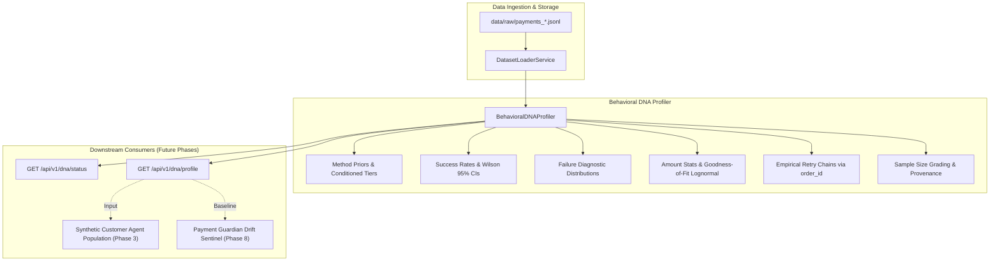

# Behavioral DNA Specification & Profiling Architecture

> **Document Status**: Production Specification  
> **Version**: 1.0.0  
> **Target Module**: `backend/app/services/dna_profiler.py` & `backend/app/models/dna.py`

---

## 1. Overview & Conceptual Role

The **Behavioral DNA** is the empirical statistical representation of a merchant's checkout and payment ecosystem. It captures customer instrument preferences, conditional failure patterns, transaction amount distributions, and multi-attempt retry dynamics from observed payment records.

---

## 2. Provenance Strategy: Observed vs. Synthetic Data

To maintain absolute mathematical honesty and adhere to the **Zero Vaporware Principle**, every profile explicitly records its provenance:

| Provenance Tag | Trigger Condition | Intended Use |
| :--- | :--- | :--- |
| **`OBSERVED_RAZORPAY_DATA`** | Derived purely from real/test transaction dumps retrieved from Razorpay API. | Production simulations, merchant policy evaluations, and real-time drift monitoring. |
| **`SYNTHETIC_BENCHMARK_DATA`** | Generated using benchmark empirical distributions when the merchant's account has 0 or insufficient payments. | Baseline exploration, onboarding sandboxes, and developer testing. |
| **`NO_DATA_AVAILABLE`** | Returned when `data/raw/` contains 0 payment records. | Honest zero-state reporting. |

The schema enforces `is_synthetic_benchmark: bool` and tracks all underlying file names in `source_datasets`.

---

## 3. Sample-Size Confidence & Reliability Policy

| Sample Size ($N$) | Grade | Adequacy | Statistical Behavior |
| :--- | :--- | :--- | :--- |
| **$N = 0$** | `UNAVAILABLE` | False | Zero-state profile with empty distributions. No fake numbers. |
| **$1 \le N < 10$** | `INSUFFICIENT_DATA` | False | Basic arithmetic means only; Wilson CIs and parametric fits disabled. |
| **$10 \le N < 50$** | `GRADE_C` | False | Empirical distributions and Wilson CIs enabled; parametric fitting disabled. |
| **$50 \le N < 250$** | `GRADE_B` | True | Full empirical distributions, method-level priors, and lognormal MLE fit. |
| **$N \ge 250$** | `GRADE_A` | True | High-resolution statistical profile including bank-level breakdowns and KS goodness-of-fit validation. |

### Subsegment Reliability Flags:
* $N_s \ge 50 \implies \text{HIGH}$
* $20 \le N_s < 50 \implies \text{MODERATE}$
* $5 \le N_s < 20 \implies \text{LOW\_SAMPLE}$
* $N_s < 5 \implies \text{INSUFFICIENT\_DATA}$

---

## 4. Statistical Formulations

### 4.1 Wilson 95% Confidence Interval for Success Rates
Given $k$ successes out of $n$ trials (calculated only when $n \ge 5$):
$$\text{CI}_{95\%} = \frac{\hat{p} + \frac{z^2}{2n} \pm z \sqrt{\frac{\hat{p}(1-\hat{p})}{n} + \frac{z^2}{4n^2}}}{1 + \frac{z^2}{n}} \quad (z = 1.95996)$$

### 4.2 Amount Distribution & Goodness-of-Fit Validation
* Non-parametric empirical quantiles: $p_{10}, p_{25}, p_{50}, p_{75}, p_{90}, p_{95}, p_{99}$.
* Parametric Log-Normal fit is executed via MLE using `scipy.stats.lognorm.fit(arr, floc=0)` only when $N \ge 30$.
* A two-sample Kolmogorov-Smirnov test is evaluated (`scipy.stats.kstest`).
  * If $p \ge 0.05$: `is_adequate_fit = True`.
  * If $p < 0.05$: `is_adequate_fit = False` with an explicit fallback notice to empirical quantiles.

### 4.3 Empirical Retry Inference
When multiple payment records share an `order_id`:
* **Retry Rate on Failure**:
  $$P(\text{Retry} \mid \text{1st Attempt Failed}) = \frac{\text{Orders with initial failure and } \ge 2 \text{ attempts}}{\text{Orders with initial failure}}$$
* **Method Switch on Retry**:
  $$P(\text{Method}_2 \neq \text{Method}_1 \mid \text{Retry}) = \frac{\text{Retry orders with different payment method}}{\text{Total retry orders}}$$

---

## 5. What Behavioral DNA Can and Cannot Infer

### What It CAN Infer:
1. Empirical payment instrument selection frequencies.
2. Success rates per method and issuing bank.
3. Distribution of failure reasons (e.g. incorrect OTP, insufficient funds).
4. Transaction ticket size distributions and skewness.
5. Multi-attempt retry rates and method switching behavior.
6. Effective blended processing fees (MDR).

### What It CANNOT Infer (Data Boundaries):
1. **Pre-Checkout Dropouts**: Cart abandonment occurring before payment selection is unobserved in Razorpay API data.
2. **Customer Psychology**: Individual price elasticity or patience thresholds cannot be read directly from raw logs (these will be modeled as parameters in the Synthetic Agent population).

---

## 6. API Endpoints

### `GET /api/v1/dna/status`
Returns high-level readiness, sample count, and confidence grade.

### `GET /api/v1/dna/profile`
Computes and returns the complete empirical Behavioral DNA profile.
