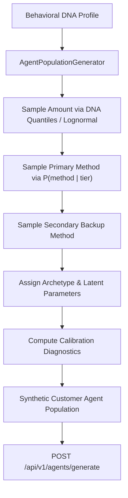
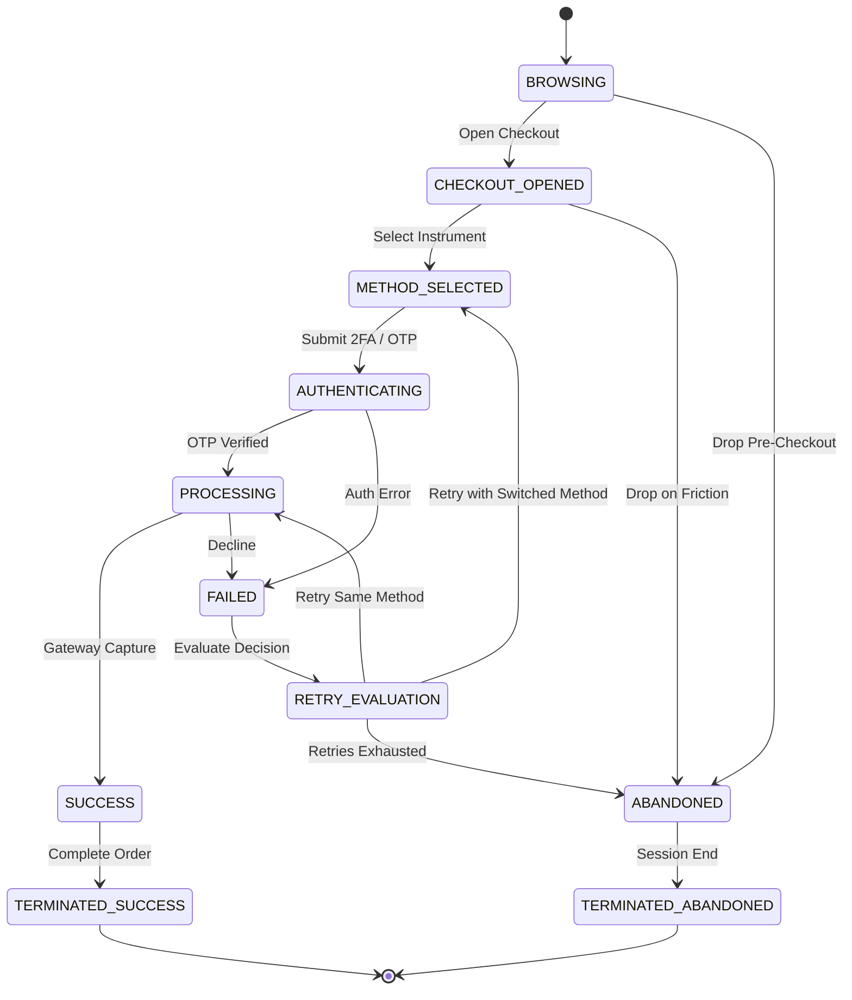

# Customer Agent Engine Specification & Architecture

> **Document Status**: Production Specification  
> **Version**: 1.0.0  
> **Target Module**: `backend/app/models/agent.py` & `backend/app/services/agent_generator.py`

---

## 1. Overview & Role in Payment Twin

The **Customer Agent Engine** transforms aggregate empirical distributions from the **Behavioral DNA** into an explicit population of stateful synthetic actors. These agents serve as the customer workload for downstream payment simulations, what-if scenario evaluations, and Pareto routing optimizations.



---

## 2. Observed vs. Latent Variables

To preserve mathematical integrity, all agent parameters are partitioned into data-grounded observations vs synthetic modelled parameters:

| Variable | Classification | Description & Source |
| :--- | :--- | :--- |
| **`primary_method`** | **Observed (DNA-Grounded)** | Selected instrument ($P(\text{method} \mid \text{amount\_tier})$) from DNA. |
| **`secondary_method`** | **Observed (DNA-Grounded)** | Backup instrument sampled from remaining methods using marginal priors. |
| **`sub_instrument`** | **Observed (DNA-Grounded)** | VPA handle (e.g. `okaxis`) or issuing bank (e.g. `HDFC`) from DNA. |
| **`transaction_amount_inr`**| **Observed (DNA-Grounded)** | Ticket size sampled from DNA Log-Normal fit or empirical ECDF quantiles. |
| **`retry_propensity`** | **Calibrated Latent** | Probability of retrying, calibrated to empirical DNA retry rate where observed. |
| **`method_switch_propensity`**| **Calibrated Latent** | Probability of switching method on retry, calibrated to DNA empirical switch rate. |
| **`max_retries`** | **Modelled Latent** | Maximum failure retry attempts ($1 \le k \le 3$) assigned by archetype. |
| **`friction_sensitivity`** | **Modelled Latent** | Probability of dropping when subjected to 2FA friction ($0.0 \le \gamma \le 1.0$). |
| **`patience_timeout_seconds`**| **Modelled Latent** | Maximum wait duration before session abandonment ($15\text{s}\text{--}180\text{s}$). |

---

## 3. Structural Archetypes

Archetypes inject structural heterogeneity into the synthetic population while calibrating to aggregate DNA priors:

| Archetype | Characteristics | Max Retries | Base Retry Propensity | Patience |
| :--- | :--- | :--- | :--- | :--- |
| **`FAST_CHECKOUT`** | Prefers low-friction UPI; low patience; 1 retry max. | 1 | $0.8 \times \mu_{\text{retry}}$ | $15\text{s}\text{--}30\text{s}$ |
| **`PATIENT_RETRYER`** | High failure tolerance; high patience; retries same instrument. | 2–3 | $1.3 \times \mu_{\text{retry}}$ | $50\text{s}\text{--}90\text{s}$ |
| **`METHOD_SWITCHER`** | Multi-rail user; switches to secondary method on 1st decline. | 2 | $1.1 \times \mu_{\text{retry}}$ | $35\text{s}\text{--}60\text{s}$ |
| **`HIGH_TICKET`** | High AOV orders; uses Netbanking/Cards; high 2FA tolerance. | 2 | $1.0 \times \mu_{\text{retry}}$ | $60\text{s}\text{--}120\text{s}$ |

---

## 4. Checkout Funnel State Machine

Agents follow an explicit, deterministic state transition graph:



---

## 5. Statistical Calibration & Invariants

When generating a population of size $N \ge 500$:
1. **Method Share Invariant**: $\text{MAE}_{\text{method}} \le 0.05$ against DNA marginal priors.
2. **Amount Consistency**: Population mean amount and quantiles correspond to DNA distributions.
3. **Retry Calibration**: Population mean retry propensity aligns with empirical DNA retry observations.

---

## 6. Determinism & Randomness Strategy

* The generator consumes a master `random_seed`.
* Sub-seeds for individual agents are derived deterministically using an isolated NumPy Generator (`np.random.default_rng`).
* Identical DNA + population size + seed **guarantees bitwise reproducible agent populations**.

---

## 7. Empty DNA & Zero-Data Behaviour

If the Behavioral DNA has status `empty` or `confidence_grade == "UNAVAILABLE"`:
* `AgentPopulationGenerator` **refuses generation** and returns HTTP 200 with `status: "unavailable"`.
* No mock agents or silent default numbers are ever fabricated.

---

## 8. API Endpoints

### `POST /api/v1/agents/generate`
Generates a calibrated population of synthetic customer agents with statistical calibration diagnostics.

* **Request Body**:
  ```json
  {
    "population_size": 1000,
    "random_seed": 42,
    "preview_count": 10
  }
  ```
* **Response Body**:
  ```json
  {
    "status": "ok",
    "message": "Successfully generated 1000 customer agents calibrated to Behavioral DNA.",
    "population_metadata": {
      "population_id": "pop_20260901_120000_seed42_1000",
      "population_size": 1000,
      "random_seed": 42,
      "source_dna_version": "1.0.0",
      "dna_provenance_type": "OBSERVED_RAZORPAY_DATA",
      "is_synthetic_benchmark": false,
      "generated_at_iso": "2026-09-01T12:00:00+00:00",
      "provenance_disclaimer": "Customer Agents are calibrated synthetic actors derived from aggregate Behavioral DNA distributions, not direct individual customer records."
    },
    "calibration_diagnostics": {
      "method_distribution_mae": 0.012,
      "amount_mean_error_inr": 18.50,
      "retry_rate_drift": 0.005,
      "method_switch_drift": 0.007,
      "archetype_distribution": {
        "FAST_CHECKOUT": 412,
        "PATIENT_RETRYER": 298,
        "METHOD_SWITCHER": 195,
        "HIGH_TICKET": 95
      },
      "is_calibrated": true,
      "warnings": []
    },
    "total_generated_count": 1000,
    "preview_agents": [...]
  }
  ```
