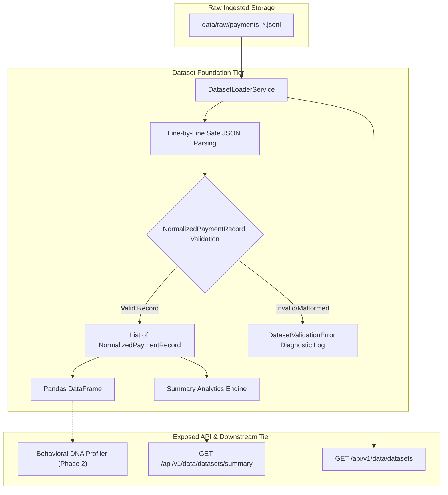

# Dataset Foundation & Inspection Specification

> **Document Status**: Production Specification  
> **Version**: 1.0.0  
> **Target Module**: `backend/app/services/dataset_reader.py` & `backend/app/models/dataset.py`

---

## 1. Overview & Data Flow

The **Dataset Foundation Layer** provides a clean, validated interface between raw `.jsonl` files stored on disk and downstream analytical modules (such as Behavioral DNA profiling).



---

## 2. Storage Format & Schema

### 2.1 File Storage Convention
* **Location**: `data/raw/` (configured via `DATA_RAW_DIR`)
* **Format**: Line-delimited JSON (`.jsonl`), UTF-8 encoded.
* **Naming**: `payments_<YYYYMMDD_HHMMSS>_<batch_id_prefix>.jsonl`

### 2.2 Record Schema Contract (`NormalizedPaymentRecord`)
Every line in the `.jsonl` file corresponds to a sanitized, normalized payment record:

```json
{
  "payment_id": "pay_O7v8G1wH2bY9Kx",
  "order_id": "order_O7v7Z1xA2cY8Jw",
  "amount_paise": 250000,
  "amount_inr": 2500.00,
  "currency": "INR",
  "status": "captured",
  "method": "upi",
  "bank": null,
  "wallet": null,
  "vpa_provider": "okaxis",
  "international": false,
  "captured": true,
  "fee_paise": 5000,
  "tax_paise": 900,
  "fee_inr": 50.00,
  "tax_inr": 9.00,
  "error_code": null,
  "error_description": null,
  "error_source": null,
  "error_step": null,
  "error_reason": null,
  "acquirer_rrn": "423456789012",
  "acquirer_auth_code": null,
  "created_at_unix": 1725150000,
  "created_at_iso": "2024-09-01T00:20:00+00:00"
}
```

### 2.3 PII Safety Guarantees
* Customer `email` and `contact` (phone number) are **strictly excluded** from `NormalizedPaymentRecord` and are never loaded or stored.
* Customer `vpa` is parsed to retain only the provider domain handle (e.g., `okaxis`, `okhdfcbank`).

---

## 3. Dataset Validation & Error Diagnostics

`DatasetLoaderService` validates every JSON line individually without halting execution or silently dropping records.

### 3.1 Error Diagnostic Structure (`DatasetValidationError`)
When a line fails validation, an error entry is recorded:
* **`line_number`**: 1-indexed line number in the JSONL file.
* **`error_type`**:
  * `JSON_DECODE_ERROR`: Broken JSON syntax.
  * `SCHEMA_VALIDATION_ERROR`: Missing required field or invalid data type.
  * `UNEXPECTED_ERROR`: General runtime exception during parsing.
* **`message`**: Human-readable diagnostic explaining why validation failed.
* **`field_name`**: The specific field that failed validation (if applicable).

---

## 4. API Endpoints

### 4.1 Dataset Listing: `GET /api/v1/data/datasets`
Returns all `.jsonl` datasets present in `data/raw/` with their validation status:

```json
{
  "status": "ok",
  "message": "Datasets retrieved successfully.",
  "total_datasets": 1,
  "datasets": [
    {
      "filename": "payments_20260901_120000_abcd1234.jsonl",
      "file_path": "/Users/apple/Documents/Payment Twin/data/raw/payments_20260901_120000_abcd1234.jsonl",
      "file_size_bytes": 1024,
      "total_lines": 10,
      "valid_records": 10,
      "invalid_records": 0,
      "is_valid": true,
      "created_at_iso": "2026-09-01T12:00:00+00:00",
      "modified_at_iso": "2026-09-01T12:00:00+00:00",
      "validation_errors": []
    }
  ]
}
```

### 4.2 Dataset Summary: `GET /api/v1/data/datasets/summary`
Calculates empirical statistics across all stored records (or a specific file via `?filename=...`):

```json
{
  "status": "ok",
  "message": "Dataset summary generated successfully.",
  "dataset_source": "all_datasets",
  "total_records": 100,
  "financial_metrics": {
    "total_amount_inr": 185400.0,
    "average_amount_inr": 1854.0,
    "median_amount_inr": 1500.0,
    "min_amount_inr": 100.0,
    "max_amount_inr": 15000.0,
    "total_fee_inr": 3708.0,
    "total_tax_inr": 667.44
  },
  "status_metrics": {
    "captured_count": 88,
    "failed_count": 12,
    "other_count": 0,
    "success_rate_percent": 88.0,
    "failure_rate_percent": 12.0,
    "status_counts": {
      "captured": 88,
      "failed": 12
    }
  },
  "method_distribution": {
    "upi": 64,
    "card": 28,
    "netbanking": 8
  },
  "method_percentage": {
    "upi": 64.0,
    "card": 28.0,
    "netbanking": 8.0
  },
  "bank_distribution": {
    "HDFC": 20,
    "SBIN": 8
  },
  "vpa_provider_distribution": {
    "okaxis": 34,
    "okhdfcbank": 30
  },
  "currency_distribution": {
    "INR": 100
  },
  "international_count": 0,
  "time_range": {
    "earliest_unix": 1725100000,
    "latest_unix": 1725150000,
    "earliest_iso": "2026-09-01T00:00:00+00:00",
    "latest_iso": "2026-09-01T13:53:20+00:00",
    "timespan_seconds": 50000
  }
}
```

---

## 5. Graceful Empty Dataset Handling

When `data/raw/` contains no `.jsonl` files (e.g. fresh repository or zero test payments):
* `GET /api/v1/data/datasets` returns:
  ```json
  {
    "status": "empty",
    "message": "No payment datasets are currently available.",
    "total_datasets": 0,
    "datasets": []
  }
  ```
* `GET /api/v1/data/datasets/summary` returns:
  ```json
  {
    "status": "empty",
    "message": "No payment datasets are currently available.",
    "total_records": 0
  }
  ```
* The service **never** creates synthetic or fake Razorpay data automatically.

---

## 6. Critical Data Policy: Observed Data vs. Synthetic Data

> [!IMPORTANT]
> **Data Integrity Boundary**:
> 1. **Observed Razorpay Data**: Transactions originating from the live Razorpay API (`/v1/payments`).
> 2. **Synthetic / Benchmark Data**: When generated for offline modeling or empty test environments, synthetic data must be **explicitly labeled** as `SYNTHETIC / BENCHMARK DATA` and stored with distinct metadata tags, preventing any confusion with empirical merchant telemetry.
