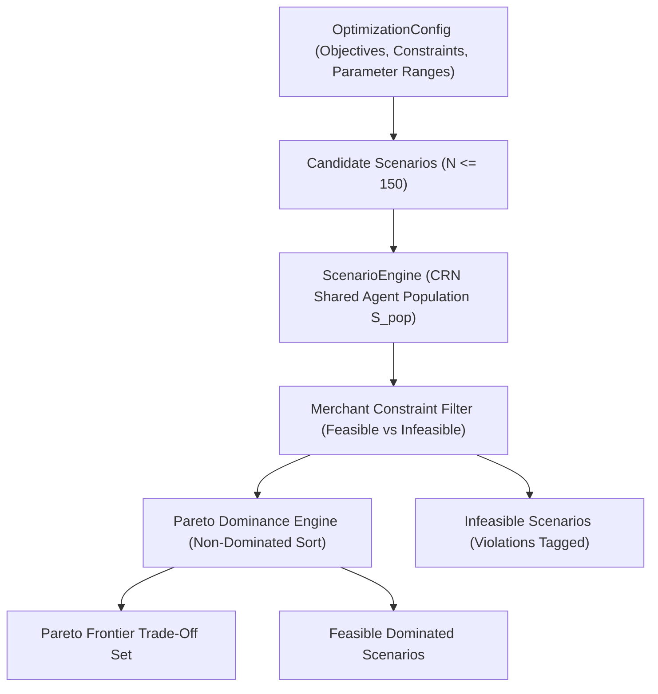

# Pareto Frontier Multi-Objective Optimization Specification & Architecture

> **Document Status**: Production Specification  
> **Version**: 1.0.0  
> **Target Module**: `backend/app/models/optimization.py`, `backend/app/services/pareto_optimizer.py`, & `backend/app/api/routes/optimization.py`

---

## 1. Overview & Objectives

The **Pareto Frontier Optimization Engine** extends the Payment Twin beyond single-scenario evaluations. Rather than picking an arbitrary "best" scenario, it maps the non-dominated mathematical trade-off curve across competing merchant goals (e.g. maximizing net revenue vs. maximizing conversion rate vs. minimizing processing costs).

---

## 2. Multi-Objective Definitions & Directions

Every optimization objective specifies its target KPI, optimization direction ($+1$ for Maximize, $-1$ for Minimize), and measurement unit.

| Objective Enum | Metric Name | Direction | Unit |
| :--- | :--- | :--- | :--- |
| **`MAX_NET_REVENUE`** | `net_merchant_revenue_inr` | **MAXIMIZE** ($\uparrow$) | INR (₹) |
| **`MAX_CONVERSION_RATE`** | `conversion_rate_percent` | **MAXIMIZE** ($\uparrow$) | % |
| **`MIN_PROCESSING_FEES`** | `total_processing_fees_inr` | **MINIMIZE** ($\downarrow$) | INR (₹) |
| **`MIN_FAILURE_RATE`** | `failure_rate_percent` | **MINIMIZE** ($\downarrow$) | % |
| **`MIN_ABANDONMENT_RATE`**| `abandonment_rate_percent`| **MINIMIZE** ($\downarrow$) | % |
| **`MIN_AVG_ATTEMPTS`** | `average_attempts_per_success`| **MINIMIZE** ($\downarrow$) | Scalar |

---

## 3. Pareto Dominance Mathematics

Let $\mathcal{F}$ be the set of all feasible candidate solutions evaluated across $K$ objectives. Standardized objective vectors are defined such that higher is strictly better:
$$f_k(\mathbf{x}) = \begin{cases} M_k(\mathbf{x}) & \text{if direction is MAXIMIZE} \\ -M_k(\mathbf{x}) & \text{if direction is MINIMIZE} \end{cases}$$

### Strict Dominance Condition:
Scenario $\mathbf{A}$ strictly **dominates** Scenario $\mathbf{B}$ ($\mathbf{A} \succ \mathbf{B}$) iff:
$$\forall k \in \{1, \dots, K\}, \quad f_k(\mathbf{A}) \ge f_k(\mathbf{B}) \quad \text{AND} \quad \exists k \in \{1, \dots, K\}, \quad f_k(\mathbf{A}) > f_k(\mathbf{B})$$

* **Non-Dominated Pareto Frontier**:
  $$\mathcal{P}^* = \left\{ \mathbf{x} \in \mathcal{F} \;\Big|\; \nexists \mathbf{y} \in \mathcal{F} \text{ such that } \mathbf{y} \succ \mathbf{x} \right\}$$
* **No Arbitrary Scalar Weights**: No arbitrary scalar weights are used. Dominance is evaluated directly across all objective dimensions.

---

## 4. Hard Merchant Constraints & Feasibility Filtering

Hard operational constraints are evaluated **before** dominance sorting:

| Constraint Type | Formula | Infeasibility Condition |
| :--- | :--- | :--- |
| **`MIN_CONVERSION_RATE`** | $\text{Conversion} \ge \tau_{\text{conv}}$ | Conversion rate $< \tau_{\text{conv}}$ |
| **`MAX_PROCESSING_FEES`** | $\text{Fees} \le \tau_{\text{fee}}$ | Total processing fees $> \tau_{\text{fee}}$ |
| **`MAX_FAILURE_RATE`** | $\text{Failure} \le \tau_{\text{fail}}$ | Terminal failure rate $> \tau_{\text{fail}}$ |
| **`MIN_NET_REVENUE`** | $\text{Net Revenue} \ge \tau_{\text{rev}}$ | Net merchant revenue $< \tau_{\text{rev}}$ |

Infeasible candidates are preserved in the response under `infeasible_scenarios` with the exact violated constraints listed for full merchant auditability.

---

## 5. Candidate Generation & Common Random Numbers (CRN)

* **Candidate Limit**: Expands parameter grids up to **150 candidate scenarios** per request.
* **Shared CRN Population**: Evaluates all candidate scenarios and the baseline against the **exact same pre-generated CustomerAgent population** $P(S_{\text{pop}})$.
* **Methodological Clarity**: CRN ensures fair paired comparisons by removing population-level demographic mismatch; it is a variance-reduction technique rather than a causal proof.

---

## 6. Uncertainty Reporting

For every scenario on the non-dominated Pareto frontier, the engine reports analytical **95% Confidence Intervals** ($[\mu \pm 1.96 \cdot \text{SEM}]$) for net revenue and conversion rates.

---

## 7. API Endpoints

### `POST /api/v1/optimization/pareto`
Executes multi-objective optimization across candidate parameter ranges and returns the Pareto frontier, dominated count, infeasible items, and trade-off summaries.
