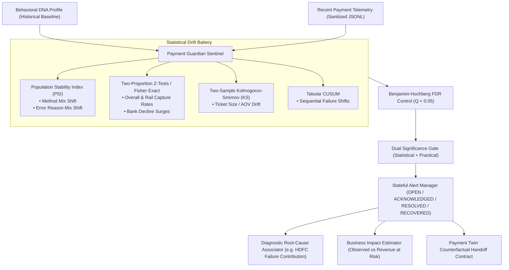
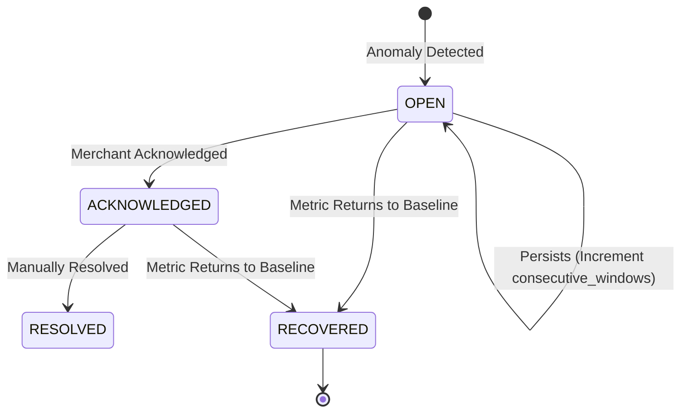

# Payment Guardian Sentinel Specification & Architecture

> **Document Status**: Production Specification  
> **Version**: 1.0.0  
> **Target Module**: `backend/app/models/guardian.py`, `backend/app/services/drift_detectors.py`, `backend/app/services/guardian_service.py`, & `backend/app/api/routes/guardian.py`

---

## 1. Overview & System Mission

**Payment Guardian Sentinel** is the automated statistical surveillance and telemetry drift detection layer of **Payment Twin**. It continuously monitors recent merchant payment records against the empirical **Behavioral DNA** baseline to identify degradation in capture rates, distribution shifts, issuing bank outages, and revenue-at-risk, without automated or disruptive production interference.



---

## 2. Baseline Establishment & Reliability Gating

* **Empirical Grounding**: Guardian relies on the merchant's `BehavioralDNAProfile` as its source of truth.
* **Reliability Gating**:
  * `GRADE_A` / `GRADE_B`: Standard sensitivity thresholds applied.
  * `GRADE_C` / `INSUFFICIENT_DATA`: Allowed with an explicit `reliability_warning: "Baseline established on low-sample DNA"`.
  * `UNAVAILABLE` or `status: "empty"`: Guardian **strictly refuses execution** (`status: "unavailable"`).

---

## 3. Sliding Observation Windows

* **Modes Supported**:
  * `COUNT_BASED`: Evaluates the last $N$ transactions ($30 \le N \le 5000$, default: $200$).
  * `TIME_BASED`: Evaluates transactions occurring within the last $T$ hours ($0.5 \le T \le 72.0$, default: $4.0\text{h}$).
* **Minimum Sample Size Requirement**: $\ge 30$ transactions in the observation window. Guardian will not run hypothesis tests on sample noise below this threshold.

---

## 4. Pure Statistical Drift Detectors

| Monitored Metric | Data Type | Algorithm | Minimum Sample | Notes |
| :--- | :--- | :--- | :--- | :--- |
| **Payment Method Mix** | Categorical | **Population Stability Index (PSI)** | $N \ge 50$ | $\text{PSI} \ge 0.10 \implies$ Moderate, $\ge 0.25 \implies$ Significant |
| **Error Reason Mix** | Categorical | **Population Stability Index (PSI)** | $N_{\text{failed}} \ge 20$ | Detects shifts in error classification shares |
| **Capture Rates (Overall & Method)** | Binary Proportion | **Two-Proportion Z-Test** | $N \ge 30$ | Large-sample normal approximation |
| **Bank Capture Rates** | Binary Proportion | **Two-Proportion / Fisher Exact** | $N_{\text{bank}} \ge 15$ | Fisher exact fallback for small contingency tables |
| **Transaction Amount Distribution** | Continuous | **Two-Sample Kolmogorov-Smirnov (KS)** | $N \ge 40$ | Non-parametric empirical CDF comparison |
| **Sequential Failure Shift** | Time-series Rate | **Tabular CUSUM ($S_t^+$)** | $W \ge 3$ windows | Detects persistent drift over sequential batches |

> [!IMPORTANT]
> **No Fabricated P-Values**: PSI and CUSUM are distance and cumulative sum metrics; they do NOT produce p-values and do not participate in Benjamini-Hochberg FDR correction.

---

## 5. False Discovery Rate (FDR) Multiple Testing Control

When monitoring $15\text{--}25$ metrics concurrently, uncorrected hypothesis testing causes severe false alarm inflation. Guardian implements the **Benjamini-Hochberg (BH)** procedure targeting $\text{FDR} \le 0.05$:
$$p_{(k)} \le \frac{k}{M} \times Q$$
Adjusted p-values ($p_{\text{adj}}$) determine statistical significance while preserving statistical power.

---

## 6. Dual Significance Gate & Practical Effect Sizes

An alert is raised **only if both criteria are met**:
1. **Statistical Evidence**: $p_{\text{adj}} < 0.05$ (or $\text{PSI} \ge 0.10$ or CUSUM alarm).
2. **Practical Business Significance**:
   * Capture Rate Drop $\ge 3.0$ percentage points ($|\Delta p| \ge 0.03$).
   * Method Share Shift $\ge 5.0$ percentage points ($|\Delta \text{share}| \ge 0.05$).
   * Bank Failure Surge $\ge 8.0$ percentage points ($|\Delta p| \ge 0.08$).
   * AOV Median Shift $\ge 15.0\%$.

---

## 7. Alert Severity Matrix

Severity is derived deterministically from evidence magnitude, target rail, and volume:
* **`INFO`**: Moderate categorical drift ($0.10 \le \text{PSI} < 0.25$).
* **`LOW`**: Significant drop in secondary payment methods ($< 10\%$ volume) or AOV shift.
* **`MEDIUM`**: Capture rate drop in primary rails ($5\% \le \Delta p < 12\%$) or bank decline surges.
* **`HIGH`**: Severe primary rail capture drop ($\Delta p \ge 12\%$) or major issuing bank outage.
* **`CRITICAL`**: Rail collapse (overall success drop $\ge 15\%$, or primary rail capture $< 60\%$, or persistent CUSUM alarm $> 3$ windows).

---

## 8. Stateful Alert Lifecycle, Deduplication, & Auto-Recovery



* **Fingerprinting**: `fp_{metric_name}_{target_entity}` guarantees single alert representation across windows.
* **Auto-Recovery**: When telemetry returns to normal ($|\Delta| < \text{threshold}$ and $p_{\text{adj}} \ge 0.05$), status transitions from `OPEN` $\to$ `RECOVERED` with recovery timestamp recorded. Alerts are never deleted.

---

## 9. Diagnostic Root-Cause Associations

Guardian performs empirical cross-tabulations to identify disproportionate failure contributions:
$$\text{Contribution}_{\text{bank}} = \frac{\text{Excess Failures}_{\text{bank}}}{\text{Total Excess Failures}_{\text{rail}}} \times 100\%$$
* **Careful Association Wording**: Explicitly reported as *"HDFC-linked transactions were associated with 76.5% of excess declines."* Never claims causation without proof.

---

## 10. Business Impact & Revenue at Risk

* **Observed Failures**: Realized declines in the recent window.
* **Expected Failures**: $N_{\text{recent}} \times (1 - p_{\text{base}})$.
* **Excess Failed Orders**: $\max(0, N_{\text{failed, recent}} - \text{Expected Failures})$.
* **Estimated Revenue at Risk**: $\text{Excess Failed Orders} \times \text{AOV}_{\text{base}}$ (labeled explicitly as an estimate).

---

## 11. Payment Twin Handoff Contract (`GuardianTwinHandoff`)

Structured data-only contract for handing anomalies to Payment Twin for What-If counterfactual exploration:

```json
{
  "handoff_id": "hnd_alt_upi_success_rate_1700000000",
  "source_alert_id": "alt_upi_success_rate_1700000000",
  "anomaly_type": "METHOD_SUCCESS_RATE_DEGRADATION",
  "target_entity": "upi",
  "baseline_rate": 0.9000,
  "observed_rate": 0.6000,
  "delta": -0.3000,
  "affected_order_count": 36,
  "estimated_revenue_at_risk_inr": 36000.00,
  "suggested_scenario_interventions": [
    {
      "intervention_type": "METHOD_ROUTING_PREFERENCE",
      "target": "card",
      "shift_percentage": 20.0,
      "rationale": "Test shifting traffic away from degraded UPI to Cards"
    },
    {
      "intervention_type": "METHOD_SWITCH_POLICY",
      "switch_propensity_override": 0.85,
      "preferred_fallback_method": "card",
      "rationale": "Test smart fallback recommendations on UPI declines"
    }
  ]
}
```

---

## 12. Privacy & Redaction

Guardian operates exclusively on sanitized `NormalizedPaymentRecord` entities. Zero customer emails, phone numbers, full card PANs, or raw IP addresses are ingested, processed, or logged.

---

## 13. API Endpoints

```
GET  /api/v1/guardian/status                   # System health, DNA baseline readiness, open alert count
POST /api/v1/guardian/analyze                  # Run drift detector battery over recent telemetry
GET  /api/v1/guardian/alerts                   # List historical and active alerts with status filter
POST /api/v1/guardian/alerts/{id}/acknowledge  # Transition alert from OPEN -> ACKNOWLEDGED
POST /api/v1/guardian/alerts/{id}/resolve      # Transition alert to RESOLVED
```
