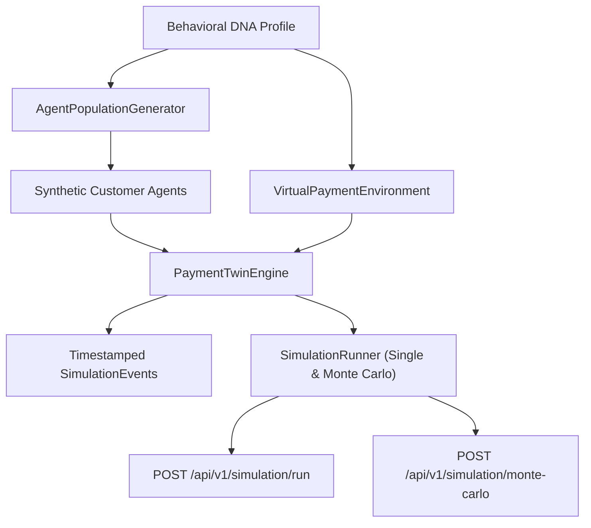

# Payment Twin Simulation Engine Specification & Architecture

> **Document Status**: Production Specification  
> **Version**: 1.0.0  
> **Target Module**: `backend/app/models/simulation.py`, `backend/app/services/payment_twin.py`, & `backend/app/services/simulation_runner.py`

---

## 1. Overview & Conceptual Role

The **Payment Twin** is a discrete-event stochastic simulation engine that executes a population of synthetic **Customer Agents** through a calibrated **Virtual Payment Environment**. It enables risk-free forward projections of merchant checkout funnels without initiating real banking transactions or touching production payment rails.



---

## 2. Virtual Payment Environment: DNA-Grounded vs. Modelled Assumptions

To preserve mathematical integrity, the environment clearly partitions empirical parameters from synthetic operational assumptions:

| Parameter | Type | Source & Formula |
| :--- | :--- | :--- |
| **`method_success_rates`** | **DNA-Derived** | $P(\text{success} \mid m)$ from `dna.success_dynamics.by_method[m].rate`. |
| **`bank_success_rates`** | **DNA-Derived** | $P(\text{success} \mid b)$ from `dna.success_dynamics.by_bank[b].rate`. |
| **`failure_reasons`** | **DNA-Derived** | Distribution from `dna.failure_diagnostics.top_error_reasons`. |
| **`mdr_rates_percent`** | **DNA-Derived** | Effective MDR percentage from `dna.fee_economics.mdr_by_method_percent`. |
| **`auth_latency_sec`** | **Modelled Assumption** | Explicit Gaussian distributions per method (e.g. $\text{UPI} \sim \mathcal{N}(4.5\text{s}, 1.2\text{s})$, $\text{Cards} \sim \mathcal{N}(8.5\text{s}, 2.5\text{s})$). |
| **`gateway_proc_latency_sec`** | **Modelled Assumption** | Gateway authorization latency ($\mathcal{N}(1.5\text{s}, 0.4\text{s})$). |
| **`network_outage_multiplier`** | **Modelled Assumption** | Scaler (default $1.0 = \text{neutral baseline}$; $< 1.0 = \text{degraded network}$). |

---

## 3. Checkout Funnel State Traversal

Each CustomerAgent advances through the formal state machine:

```
BROWSING (t=0)
  ├── CHECKOUT_OPENED (open_checkout)
  └── ABANDONED (pre_checkout_dropout)
CHECKOUT_OPENED
  ├── METHOD_SELECTED (select primary instrument)
  └── ABANDONED (friction dropout)
METHOD_SELECTED
  ├── AUTHENTICATING (initiate 2FA/OTP)
  └── ABANDONED
AUTHENTICATING
  ├── PROCESSING (OTP verified)
  ├── FAILED (OTP error / auth timeout)
  └── ABANDONED (patience timeout exceeded)
PROCESSING
  ├── SUCCESS → TERMINATED_SUCCESS (captured)
  ├── FAILED (declined)
  └── ABANDONED
FAILED
  ├── RETRY_EVALUATION
  └── ABANDONED
RETRY_EVALUATION
  ├── METHOD_SELECTED (retry with switched instrument)
  ├── AUTHENTICATING / PROCESSING (retry same instrument)
  └── ABANDONED → TERMINATED_ABANDONED (max retries exhausted)
```

---

## 4. Financial Accounting: GMV vs. Attempt Volume

To ensure accounting precision and avoid double-counting during retries:

1. **Order GMV / Gross Attempted Volume**:
   Each agent's transaction amount is counted **only once** in `gross_attempted_volume_inr`.
2. **Conservation Invariant**:
   $$\text{Gross Attempted Volume} = \text{Captured Volume} + \text{Lost Volume}$$
3. **Net Merchant Revenue**:
   $$\text{Net Revenue} = \text{Captured Volume} - \text{Total Processing Fees} - \text{Total Taxes}$$
4. **Attempt Volume**:
   Attempt counts and volumes are tracked separately under `total_payment_attempts` and `MethodSimulationKPI.attempted_volume_inr`.

---

## 5. Monte Carlo Multi-Run Uncertainty Engine

The `SimulationRunner.run_many()` executes $M$ independent stochastic simulation sweeps (e.g. $M = 20\text{--}50$) with deterministic seeds ($S_{\text{master}} + k$).

For each primary KPI (conversion rate, captured volume, net revenue, retry rate), it computes:
* **Mean ($\mu$)**
* **Sample Standard Deviation ($\sigma$)**
* **95% Confidence Interval**: $[\mu - 1.96 \cdot \frac{\sigma}{\sqrt{M}}, \mu + 1.96 \cdot \frac{\sigma}{\sqrt{M}}]$
* **Empirical Percentiles**: $p_5, p_{50}, p_{95}$

---

## 6. Determinism & Random Seeding

* Consumes a deterministic master `random_seed`.
* Sub-seeds for individual agents and Monte Carlo iterations are isolated and derived without modifying global PRNG state.
* Identical inputs **guarantee bitwise identical KPI results and event traces**.

---

## 7. Empty-DNA & Zero-Data Behaviour

When the current repository dataset contains 0 payments (Behavioral DNA is `UNAVAILABLE`):
* `POST /api/v1/simulation/run` and `POST /api/v1/simulation/monte-carlo` **refuse execution**.
* Returns HTTP 200 with `status: "unavailable"` and zero fake outcomes.

---

## 8. API Endpoints

### `POST /api/v1/simulation/run`
Executes a single simulation run and returns executive summary KPIs and preview event traces.

### `POST /api/v1/simulation/monte-carlo`
Executes a multi-run Monte Carlo sweep and returns aggregated distributions and risk bounds.
