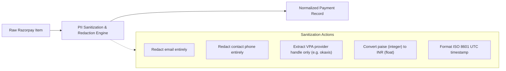

# Razorpay Test Mode Data Ingestion Specification

> **Document Status**: Production Specification  
> **Version**: 1.0.0  
> **Target Module**: `backend/app/services/razorpay_client.py` & `backend/app/services/ingestion.py`

---

## 1. Official Razorpay Endpoint Specification

The data ingestion layer communicates with the official Razorpay Payments REST API.

| Property | Specification |
| :--- | :--- |
| **HTTP Method** | `GET` |
| **Base URL** | `https://api.razorpay.com/v1` |
| **Endpoint** | `/payments` (Full URI: `https://api.razorpay.com/v1/payments`) |
| **Authentication** | HTTP Basic Authentication (`RAZORPAY_KEY_ID` : `RAZORPAY_KEY_SECRET`) |
| **Query Parameters** | `count` (1–100), `skip` (offset $\ge 0$), `from` (UNIX timestamp), `to` (UNIX timestamp) |
| **Response Format** | JSON object with `entity: "collection"`, `count: int`, and `items: list[PaymentEntity]` |

---

## 2. Verified Razorpay API Response Fields

Based on official Razorpay API documentation and payload validation, the following fields are observed on payment entities:

```json
{
  "id": "pay_O7v8G1wH2bY9Kx",
  "entity": "payment",
  "amount": 250000,
  "currency": "INR",
  "status": "captured",
  "order_id": "order_O7v7Z1xA2cY8Jw",
  "invoice_id": null,
  "international": false,
  "method": "upi",
  "amount_refunded": 0,
  "refund_status": null,
  "captured": true,
  "description": "Payment for Order #1001",
  "card_id": null,
  "bank": null,
  "wallet": null,
  "vpa": "customer@okaxis",
  "email": "customer@example.com",
  "contact": "+919876543210",
  "fee": 5000,
  "tax": 900,
  "error_code": null,
  "error_description": null,
  "error_source": null,
  "error_step": null,
  "error_reason": null,
  "acquirer_data": {
    "rrn": "423456789012",
    "upi_transaction_id": "UPI423456789"
  },
  "created_at": 1725150000
}
```

### 2.1 Available Failure Diagnostics
When a transaction fails, Razorpay returns structured failure diagnostics:
- **`error_code`**: Machine code (e.g., `BAD_REQUEST_ERROR`, `GATEWAY_ERROR`, `SERVER_ERROR`).
- **`error_description`**: Human-readable message (e.g., "Payment processing failed because of incorrect OTP").
- **`error_source`**: Origin of failure (`customer`, `bank`, `gateway`, `business`, `internal`).
- **`error_step`**: Funnel stage where failure occurred (`payment_authentication`, `payment_authorization`).
- **`error_reason`**: Granular reason string (`incorrect_otp`, `insufficient_funds`, `payment_cancelled`).

---

## 3. Critical Data Boundary: What Razorpay Does NOT Provide

> [!IMPORTANT]
> **Zero Assumptions Rule**: The Razorpay API returns transaction event telemetry, not customer psychology or unobserved funnel events.

The following attributes **are not** provided by Razorpay and must **never** be fabricated in the ingestion layer:
1. **Pre-Checkout Funnel Drops**: Razorpay only sees checkouts where payment was initiated. Abandonments occurring prior to payment selection are not present in Razorpay payment logs.
2. **Customer Behavioral Traits**: Price elasticity ($\epsilon$), retry tolerance ($K$), 3DS friction aversion ($\gamma$), and patience thresholds ($\tau$) are **not** in the raw data.
3. **Customer Psychological Archetypes**: Archetype classifications (e.g., "Tech-Savvy UPI-first", "Impatient Mobile Shopper") are synthetic agent models developed later in Phase 2 & 3.

---

## 4. Normalization and PII Sanitization Contract

The ingestion service converts `RazorpayPaymentItem` entities into `NormalizedPaymentRecord` objects.



### Normalized Schema:
```json
{
  "payment_id": "pay_O7v8G1wH2bY9Kx",
  "order_id": "order_O7v7Z1xA2cY8Jw",
  "amount_paise": 250000,
  "amount_inr": 2500.00,
  "currency": "INR",
  "status": "captured",
  "method": "upi",
  "bank": null,
  "wallet": null,
  "vpa_provider": "okaxis",
  "international": false,
  "captured": true,
  "fee_paise": 5000,
  "tax_paise": 900,
  "fee_inr": 50.00,
  "tax_inr": 9.00,
  "error_code": null,
  "error_description": null,
  "error_source": null,
  "error_step": null,
  "error_reason": null,
  "acquirer_rrn": "423456789012",
  "acquirer_auth_code": null,
  "created_at_unix": 1725150000,
  "created_at_iso": "2024-09-01T00:20:00+00:00"
}
```

---

## 5. Storage Format & Determinism

Normalized datasets are persisted deterministically under `data/raw/`:
- **Format**: Line-delimited JSON (`.jsonl`), UTF-8 encoded.
- **Naming Convention**: `data/raw/payments_<YYYYMMDD_HHMMSS>_<batch_id_prefix>.jsonl`
- **Git Tracking**: All `.jsonl` and `.csv` files under `data/raw/` are excluded from Git via `.gitignore`, preserving `.gitkeep`.

---

## 6. How to Configure & Run Ingestion

### 6.1 Configure Environment Variables
Create a local `.env` file (copied from `.env.example`):

```bash
RAZORPAY_KEY_ID=rzp_test_YourKeyIdHere
RAZORPAY_KEY_SECRET=YourKeySecretHere
```

### 6.2 Trigger Ingestion via REST API

```bash
curl -X POST "http://localhost:8000/api/v1/data/payments/ingest" \
  -H "Content-Type: application/json" \
  -d '{
    "count": 50,
    "skip": 0,
    "max_pages": 2,
    "save_to_disk": true
  }'
```

#### Example API Response:
```json
{
  "status": "success",
  "batch_id": "9b1deb4d-3b7d-4bad-9bdd-2b0d7b3dcb6d",
  "records_fetched": 100,
  "records_saved": 100,
  "file_path": "/Users/apple/Documents/Payment Twin/data/raw/payments_20260901_032500_9b1deb4d.jsonl",
  "timestamp_range": {
    "min_unix": 1725100000,
    "max_unix": 1725150000
  },
  "methods_breakdown": {
    "upi": 64,
    "card": 28,
    "netbanking": 8
  },
  "status_breakdown": {
    "captured": 88,
    "failed": 12
  }
}
```

---

## 7. Testing Strategy

All unit and integration tests strictly mock external HTTP calls:
- `httpx.AsyncClient.get` is intercepted using `unittest.mock.AsyncMock` and `patch`.
- Test suites validate:
  1. Complete normalization & PII redaction.
  2. Multi-page pagination loops.
  3. Missing credentials (`RAZORPAY_CONFIG_ERROR` / HTTP 503).
  4. Authentication failures (`RAZORPAY_AUTH_ERROR` / HTTP 401).
  5. Acquirer/API server errors (`RAZORPAY_API_ERROR` / HTTP 500/502).
  6. Network timeouts (`RAZORPAY_CONNECTION_ERROR` / HTTP 504).
  7. Verification that secrets are never leaked in logs or error bodies.
