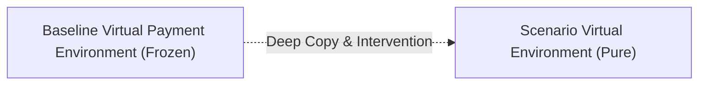

# What-If Scenario Engine Specification & Architecture

> **Document Status**: Production Specification  
> **Version**: 1.0.0  
> **Target Module**: `backend/app/models/scenario.py`, `backend/app/services/scenario_engine.py`, & `backend/app/api/routes/scenarios.py`

---

## 1. Overview & Objectives

The **What-If Scenario Engine** enables merchants to model hypothetical business interventions and policy shifts on their payment checkout funnels in a counterfactual virtual environment.

It answers critical merchant questions such as:
* *"What is the revenue impact if UPI capture rate increases from 88% to 94%?"*
* *"What happens if we switch from 1 retry to 3 retries on Card declines?"*
* *"What is the ROI of negotiating our Card MDR down from 2.1% to 1.6%?"*
* *"How will a 40% reduction in OTP authentication latency reduce cart dropoff?"*

---

## 2. Declarative Intervention Types

Every policy change is modeled as a declarative, strongly typed `ScenarioIntervention`:

| Intervention Type | Target | Parameters | Impact Mechanism |
| :--- | :--- | :--- | :--- |
| **`METHOD_SUCCESS_RATE`** | `upi`, `card`, `netbanking` | `mode` (`ABSOLUTE` or `DELTA`), `value` | Modifies $P(\text{success} \mid \text{method})$ in virtual environment. |
| **`METHOD_ROUTING_PREFERENCE`** | `upi`, `card`, `netbanking` | `shift_percentage` ($-100\%$ to $+100\%$) | Shifts customer payment method selection while preserving GMV amounts. |
| **`RETRY_POLICY`** | Global / Agent | `max_retries_override`, `retry_propensity_multiplier` | Adjusts failure recovery capacity and retry willingness. |
| **`METHOD_SWITCH_POLICY`** | Global / Agent | `switch_propensity_override`, `preferred_fallback_method` | Models smart fallback recommendations on decline. |
| **`LATENCY_FRICTION`** | Global / Environment | `auth_latency_multiplier`, `gateway_proc_latency_multiplier` | Modulates OTP/gateway wait times against customer patience limits. |
| **`FEE_MDR_RATE`** | `card`, `netbanking`, `upi` | `value` ($0.0\%$ to $10.0\%$) | Modifies processing MDR and taxes without altering conversion. |
| **`BANK_HEALTH_MODIFIER`** | Issuing Bank (e.g. `HDFC`) | `health_multiplier` ($0.0$ to $1.0$) | Simulates bank-specific performance degradation or outages. |

---

## 3. Scenario Isolation & Immutability

* The baseline environment is **frozen and immutable**.
* Each scenario operates on an isolated clone, guaranteeing zero side-effects.

---

## 4. Common Random Numbers (CRN) Strategy

To isolate true intervention effects from random sampling noise:
* The synthetic `CustomerAgent` population is generated **once** using a shared master population seed $S_{\text{pop}}$.
* Both the Baseline and all Scenario variants execute against the **exact same individual agents** and identical order transaction amounts.
* **Important Note**: Common Random Numbers is an established stochastic variance-reduction technique that eliminates random population mismatch; it is not a claim of a guaranteed fixed percentage reduction in variance.

---

## 5. Paired Comparison Mathematics & Financial Conservation

For every metric $M$, the comparative engine calculates:
$$\text{Absolute Delta} = M_{\text{scenario}} - M_{\text{baseline}}$$
$$\text{Percentage Delta} = \begin{cases} \left(\frac{M_{\text{scenario}} - M_{\text{baseline}}}{|M_{\text{baseline}}|}\right) \times 100 & \text{if } M_{\text{baseline}} \ne 0 \\ \text{null} & \text{if } M_{\text{baseline}} = 0 \end{cases}$$

### Financial Invariants:
1. **GMV Conservation**: Total attempted order GMV is identical across baseline and scenario ($\Delta \text{GMV} = 0.0$).
2. **Order Volume Partitioning**:
   $$\text{Captured Volume} + \text{Lost Volume} = \text{Gross Attempted Volume}$$
3. **Net Merchant Revenue**:
   $$\text{Net Revenue} = \text{Captured Volume} - \text{Total Processing Fees} - \text{Total Taxes}$$

---

## 6. Transparent Causal Attribution

Rather than ungrounded narrative text or black-box ML inference, the engine builds a deterministic **4-Step Attribution Trail**:
1. **`DIRECT_LEVER`**: Summary of applied intervention parameters.
2. **`FUNNEL_REACTION`**: Total payment attempts and retry delta.
3. **`CONVERSION_IMPACT`**: Percentage point change in conversion rate and net captured orders delta.
4. **`FINANCIAL_BOTTOM_LINE`**: Captured volume change, fee change, and net revenue impact.

---

## 7. Scenario Matrix Parameter Grid Sweeps

Supports multi-dimensional Cartesian product sweeps (e.g. $[0.85, 0.95] \text{ UPI Success} \times [2.1\%, 1.6\%] \text{ Card MDR}$):
* Evaluates all combinations against baseline under CRN.
* Maximum grid limit of **25 scenarios** per request.
* Returns a ranked comparison table sorted by `net_merchant_revenue_inr`, `conversion_rate_percent`, or `processing_fees_inr`.

---

## 8. API Endpoints

* **`POST /api/v1/scenarios/run`**: Executes a single What-If scenario.
* **`POST /api/v1/scenarios/compare`**: Executes baseline + 1 to 25 scenarios under CRN and returns paired comparisons.
* **`POST /api/v1/scenarios/matrix`**: Executes a parameter grid sweep and returns ranked outcomes.
